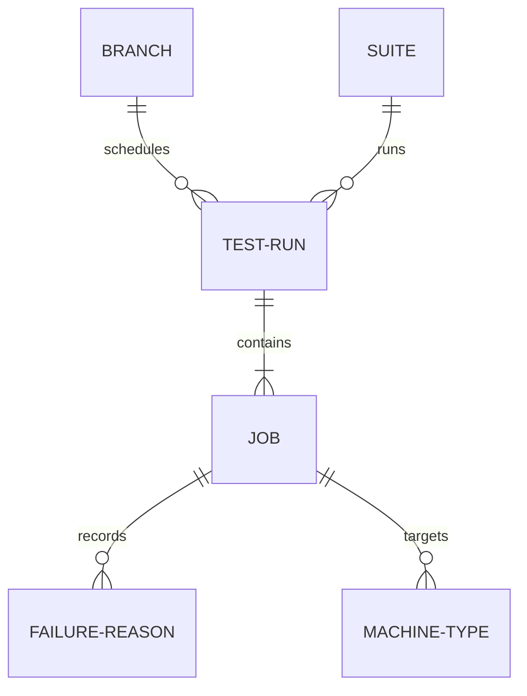

# Analysing Ceph Test Results via Paddles MCP

This skill guides you on how to use the Paddles MCP tools to analyze test runs, identify regression failures, detect flaky tests, and check hardware health.

## Core Terminology & Domain Model

Understanding the relationships between entities is crucial for performing accurate analysis:

*   **TestRun (or Run)**: A scheduled batch of tests.
    *   Has a unique `name` (representing the run folder).
    *   Contains many **Jobs**.
    *   Associated with a single `branch`, `suite`, and `scheduled`/`posted` date.
*   **Job**: An individual test execution within a run.
    *   Identified by a `job_id` under a parent `run_name`.
    *   Has a `status` (e.g. `pass`, `fail`, `dead`, `running`, `queued`, `waiting`).
    *   Records a `duration`, target machine specs (`machine_type`, `os_type`), and a `failure_reason` if it didn't pass.
*   **Branch**: The Git branch of the Ceph repository being tested (e.g. `main`, `squid`, `umbrella`). Multiple runs are scheduled per branch.
*   **Suite**: A group of test configurations representing a specific feature area (e.g. `fs`, `rgw`, `rados`).
*   **Failure Reason**: The error traceback/log message captured when a job fails. Many jobs (even across different runs and suites) can fail for the same reason.
*   **Flaky Test**: A job description that reports both `pass` and `fail` status for the exact same git commit `sha1` across different runs.

### Entity Relationships:

---

## Procedural Workflows

### 1. Assessing Overall Cluster Health
When asked about general cluster health or active run summaries, use `get_cluster_health`:
- Call `get_cluster_health(days=30)` to get a rollup of run and job success rates.
- Inspect the `badge` field (values: `Healthy`, `Degraded`, `Critical`).
- Review the `reasons` list for explanation details (e.g., low pass rates, high numbers of dead jobs).
- Check `worst_branch` and `worst_branch_fail_pct` to identify problematic branches.
- Use `stuck_6h` and `stuck_24h` counts to identify stalled test suites.

### 2. Investigating Regression & Frequent Failures
If you need to find out why runs are failing or what the most common errors are:
- Call `get_top_failures(days=30)` (optionally filtering by `branch` or `suite`).
- The returned list contains common failure reasons (e.g. timeout, connection reset) sorted by frequency.
- For each reason, note:
  - `count`: total job failures.
  - `pct`: percentage of all failed jobs in this window.
  - `runs_impacted`, `branches_impacted`, `suites_impacted`: scope of the error.
- To inspect specific runs or jobs matching a failure reason, use `get_runs` or `get_jobs` filtering by `status="fail"` or the specific name.

### 3. Detecting Flaky Tests
If you suspect test results are inconsistent:
- Call `get_flaky_tests(days=30)` (optionally filtering by `branch` or `suite`).
- Focus on tests with a high `flakiness_score` (representing jobs failing and passing on the same git SHA1).
- Analyze the `unique_failures` count to see if the test fails for the same reason or different reasons.
- Review `same_sha_flaky` to see how many SHAs had mixed pass/fail outcomes.

### 4. Evaluating Hardware and Machine Reliability
When diagnosing lab infrastructure issues vs actual code regressions:
- Call `get_hardware_reliability(days=30)`.
- Inspect the `reliability` list grouped by machine type.
- Focus on the `pct_fail` rates. If a specific machine type has high failure rates, it may indicate lab-side provisioning or hardware errors (such as SSH timeouts, reimaging failures) rather than product bugs.

### 5. Querying and Filtering Test Runs
If you need to search or narrow down specific runs:
- Use `get_runs` to list test runs.
- Set `count` (e.g. `count=10`) and `page` for pagination.
- Apply filters like `branch` (e.g., `branch="squid"`), `suite` (e.g., `suite="rados"`), or `status` (e.g., `status="fail"`).
- Filter by scheduling owner using `user` (e.g., `user="jenkins-build"`).
- Query a specific timeframe using `date`, `date_start`, or `date_end` (in `YYYY-MM-DD` format).
- If you already know the exact run name, get its specific statistics directly by calling `get_runs(run_name="...")`.

### 6. Digging Into Specific Jobs of a Run
Once you identify a failed or degraded run:
- Call `get_jobs_for_run(run_name="...")` to fetch the list of all test jobs within that run.
- Check individual job `status` and inspect the `failure_reason` for failed jobs to debug the root cause.

### 7. Searching and Inspecting Jobs Globally
When looking for specific job configurations or commits:
- Call `get_jobs` to search for jobs across all runs.
- Filter by target configuration like `os_type` (e.g., `os_type="ubuntu"`) or `machine_type` (e.g., `machine_type="smithi"`).
- Filter by Git commit `sha1` to verify if a specific code change has been tested and identify the corresponding job results.

### 8. Checking Test Nodes Status
To review the physical/virtual nodes in the testing pool:
- Call `get_nodes` (optionally filtering by `machine_type`) to retrieve the lock status, description, and machine types of the nodes.

